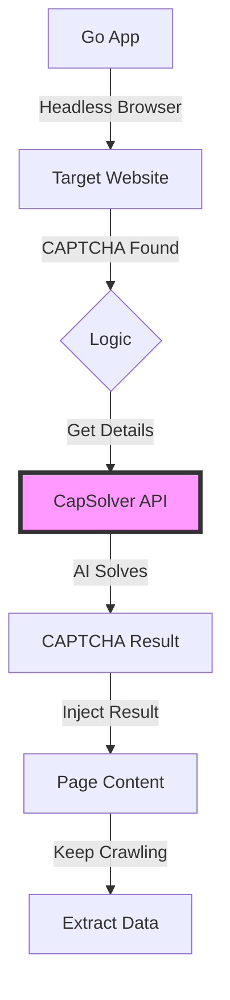

# 🛡️ Katana + CapSolver: Beat CAPTCHAs, Crawl Freely!

[](https://github.com/projectdiscovery/katana)
[](https://www.capsolver.com/?utm_source=github&utm_medium=readme&utm_campaign=katana-capsolver)
[](LICENSE)
[](https://github.com/sindresorhus/awesome)

> **Stop CAPTCHAs from blocking your web crawlers!** This project combines ProjectDiscovery's **Katana** crawler with **CapSolver** to automatically handle reCAPTCHA, Cloudflare Turnstile, and more.

---

## 🚀 Intro

CAPTCHAs are a real pain for anyone doing security research, penetration testing, or data analysis. This project fixes that! We've hooked up the super-fast **Katana** crawler with the smart **CapSolver** service. Now your headless browser can crawl without getting stuck on those annoying CAPTCHAs.

### ✨ What's Cool About It
- **🤖 AI Solves CAPTCHAs**: Easily bypasses reCAPTCHA v2/v3, Enterprise, and Cloudflare.
- **🕵️ Crawl Like a Human**: Headless browser acts like a real user, so it's harder to detect.
- **⚡ Super Fast**: Built with Go for top speed and efficiency.
- **🔧 Easy to Use**: Drop it into your existing automation setup.

---

## 🛠️ Tech Used

| Component | What it Does | Role |
| :--- | :--- | :--- |
| **Katana** | Next-gen web crawling tool | Main Engine |
| **CapSolver** | AI-powered CAPTCHA solving service | CAPTCHA Helper |
| **Go-Rod** | Advanced browser automation | Headless Browser Driver |
| **Go** | Fast programming language | Project Code |

---

## 📖 What You'll Learn

*   [x] **Headless Browser Skills**: How to set up Katana for advanced browser automation.
*   [x] **API Magic**: Using CapSolver's task-based API.
*   [x] **Beat the Bots**: Solving reCAPTCHA v2 and Cloudflare Turnstile.
*   [x] **Smart Crawling**: Tips for running your crawler efficiently and quietly.

---

## ⚙️ Get Started

### 1. Install Katana
Make sure you have **Go 1.24+** installed:
```bash
CGO_ENABLED=1 go install github.com/projectdiscovery/katana/cmd/katana@latest
```

### 2. Set Your API Key
Grab your API key from the [CapSolver Dashboard](https://dashboard.capsolver.com/dashboard/overview/?utm_source=github&utm_medium=readme&utm_campaign=katana-capsolver) and set it up:
```bash
export CAPSOLVER_API_KEY="YOUR_API_KEY"
```

### 3. Run Your Stealth Crawler
```bash
katana -u https://example.com -headless
```

---

## 🏗️ How It Works



---

## 🛡️ CAPTCHAs We Handle

| Type | Status | Speed |
| :--- | :---: | :---: |
| **reCAPTCHA v2/v3** | ✅ Supported | < 10s |
| **Cloudflare Turnstile** | ✅ Supported | < 5s |
| **AWS WAF** | ✅ Supported | < 15s |

---

## 🤝 Want to Help?

We love contributions! Here's how you can help make this project even better:

1.  Fork this repo.
2.  Create your feature branch (`git checkout -b feature/your-awesome-feature`).
3.  Commit your changes (`git commit -m 'Add a cool new feature'`).
4.  Push to your branch (`git push origin feature/your-awesome-feature`).
5.  Open a Pull Request.

---

## 📄 License

This project is under the MIT License. See the `LICENSE` file for more info.

---

## 🌟 Show Your Love

If this project helps you out, give it a ⭐️!

<p align="center">
  <a href="https://www.capsolver.com/?utm_source=github&utm_medium=readme&utm_campaign=katana-capsolver">
    
  </a>
</p>
